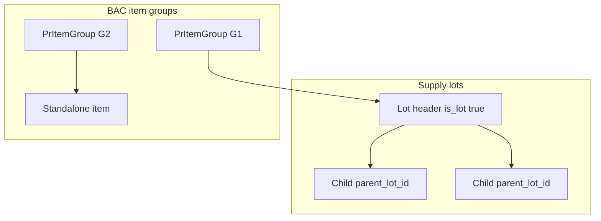

# 04 — Supply lots and BAC item groups

**Purpose:** Implement **two different grouping mechanisms**. Mixing them up will break RFQ, AOQ, and PO.

**Source:**

- `app/Models/PurchaseRequestItem.php` (`is_lot`, `parent_lot_id`, `scopeQuotable`)
- `app/Http/Controllers/SupplyPurchaseRequestController.php` (`storeLot`, `updateLot`, `destroyLot`)
- `app/Http/Controllers/PurchaseRequestController.php` (lots at create via `is_lot`, `lot_name`, `parent_lot_index`)
- `app/Models/PrItemGroup.php`
- `app/Http/Controllers/BacItemGroupController.php`
- `app/Models/PurchaseRequest.php` (`computeStatusFromGroups`, `canManageGroups`, `canCreatePo`, `canCreateAoq`)

---

## Two concepts

| | **Supply lots** | **BAC item groups** |
|--|-----------------|---------------------|
| When | PR create **or** Supply review (`submitted` / `supply_office_review`) | BAC (`bac_evaluation` / `partial_po_generation`) |
| Why | Bundle several line items into **one bid line** (one price for the lot) | Split one PR into **parallel tracks** (own RFQ, quotations, AOQ, PO) |
| Storage | Same table `purchase_request_items`: `is_lot`, `lot_name`, `parent_lot_id` | Table `pr_item_groups`; items get `pr_item_group_id` |
| Codes | None | `G1`, `G2`, … |
| Quotation grain | Quote the **lot header**, not children | Quote quotable items **inside that group** |
| Documents | Appear indented under lot in PR-level RFQ/AOQ | Per-group `RfqGeneration` / `AoqGeneration` / POs |

A PR can have lots **and** later be split into item groups. Groups partition items (including lot headers). Lot children stay display-only.

---

## Supply lots

### Shape

- **Lot header:** `is_lot = true`, `parent_lot_id = null`, `unit_of_measure = 'lot'`, `quantity_requested = 1`, `estimated_total_cost` = sum of children (Supply `storeLot` sets cost from children).
- **Lot children:** `is_lot = false`, `parent_lot_id` = header id. Display-only for bidding.
- **Standalone:** `is_lot = false`, `parent_lot_id = null`.

### Quotable scope

`PurchaseRequestItem::scopeQuotable()` → `whereNull('parent_lot_id')`.

RFQ/AOQ/quotation lines attach only to quotable rows. `markAsFailed()` cascades to `lotChildren()`.

### At PR create

Requester payload may include lots (`is_lot`, `lot_name`, `parent_lot_index`). Headers get qty 1, UOM `lot` (`createPurchaseRequestItems()`).

### During Supply review

Only if PR status is `submitted` or `supply_office_review`.

- **`storeLot`:** min **2** standalone items; create header; set `parent_lot_id` on children; recalc PR `estimated_total`.
- **`updateLot`:** rename, reassign children (min 2).
- **`destroyLot`:** detach children (`parent_lot_id = null`), delete header.

Routes: `supply.purchase-requests.lots.store|update|destroy`.

---

## BAC item groups

### Shape

`pr_item_groups`: `group_name`, `group_code` (`G1`…), `display_order`, stored `status` (default `pending`).

Each group **owns**:

- one `rfq_generation` (HasOne)
- many `quotations` (unique per supplier **per group**)
- one `aoq_generation`
- many `purchase_orders`

`PurchaseRequest::canManageGroups()` — effective status `bac_evaluation` or `partial_po_generation`.

`BacItemGroupController` store/update assigns **every** item to a group; update deletes/recreates groups.

### Computed group status (`PrItemGroup::computeStatus()`)

Earliest → latest:

| Group status | Meaning |
|--------------|---------|
| `pending` | No AOQ yet |
| `aoq_generated` | AOQ exists, no PO |
| `po_created` | At least one PO (not all approved) |
| `all_po_approved` | Every PO `approved` or later |
| `processing` | At least one PO sent/ack/delivered/completed |
| `delivered` | All POs `delivered` or `completed` |
| `completed` | All POs `completed` |

Gates:

- `canCreateAoq()` → group status `pending`
- `canRegenerateAoq()` → `aoq_generated`
- `canCreatePo()` → `aoq_generated`

### Group status → PR status

`PurchaseRequest::computeStatusFromGroups()` uses the **minimum** (earliest) group status:

| Group status | PR status |
|--------------|-----------|
| `pending` | `bac_evaluation` |
| `aoq_generated` | `bac_approved` |
| `po_created` | `partial_po_generation` |
| `all_po_approved` | `po_approved` |
| `processing` | `supplier_processing` |
| `delivered` | `delivered` |
| `completed` | `completed` |

If **no groups**, methods fall back to stored PR status.

`canCreateAoq()` non-grouped: PR status `bac_evaluation`.  
`canCreatePo()` non-grouped: `bac_approved` **or** `bac_evaluation`.

Activity actions: `item_groups_created`, `item_groups_updated`.

---

## Acceptance criteria

- [ ] Quotation forms list only `parent_lot_id IS NULL` items.
- [ ] Lot children cannot be priced separately; they fail with the header.
- [ ] Supply lot CRUD requires ≥2 standalones and only during supply review statuses.
- [ ] Destroying a lot restores children as standalones.
- [ ] Item groups use `G1`… codes unique per PR.
- [ ] One supplier may quote each group separately (unique includes `pr_item_group_id`).
- [ ] After AOQ/PO changes on a grouped PR, stored PR status matches min-group mapping.
- [ ] A grouped PR can have POs for finished groups while other groups remain in `pending` (`partial_po_generation`).
