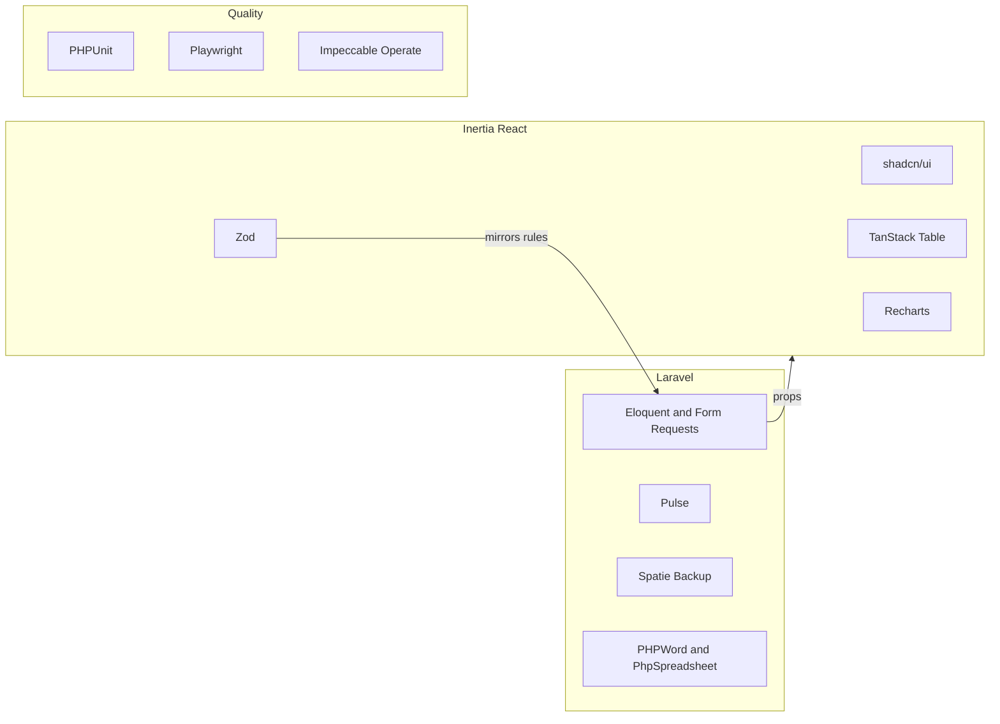

# 17 — Rebuild toolchain

**Purpose:** Freeze which libraries sit on top of Laravel 13 + Inertia React + PostgreSQL. This is not a domain spec. Behavior still lives in files 01–16.

**Source:** [`00-README.md`](00-README.md), [`16-rebuild-implementation-order.md`](16-rebuild-implementation-order.md), incumbent `composer.json` / `package.json`

**Starter assumption:** the rebuild target is a **bare** Laravel + Inertia React kit (no shadcn, no CagSU theme, maybe no Wayfinder). Slice 0 **installs** the UI kit. Do not assume official starter-kit shadcn is already present.

---

## Bare starter — Slice 0 installs the kit

Do this once. Do not add a second component library in later slices.

**Install in Slice 0:**

- TypeScript for Inertia pages if missing
- shadcn/ui on the starter’s existing Tailwind major version
- lucide-react
- Wayfinder (prefer over Ziggy)
- Spatie Permission
- Pint; Larastan if straightforward
- One **App** layout and one **Guest** layout using shadcn primitives
- `GET /health` JSON `{ status: ok, time }`, named route `health`
- PostgreSQL in `.env`; tests stay SQLite in-memory unless a query is Postgres-specific

**CagSU tokens** (map to shadcn CSS variables, not default zinc):

| Token | Hex | Role |
|-------|-----|------|
| yellow / gold | `#FFD700` | Primary gold |
| orange | `#FF8C00` | Secondary |
| maroon | `#800000` | Accent |
| blue | `#1D4ED8` | Link / info |

Dark mode only if the starter already uses `class` dark mode. Impeccable **Operate** on these layouts; no GSAP here.

**Do not install in Slice 0:** Pulse, Spatie Backup, GSAP, Playwright, Recharts, Horizon, Precognition, TanStack Table, Zod. Add those when the slice table below says so.

**Later slices:** reuse the Slice 0 shell. Do not replace shadcn.

---

## Rule

These libraries do not fight each other if each has a **narrow job**. They fail when GSAP or shadcn “delight” leaks into BAC/budget tables, or when Zod/React starts owning procurement rules that belong on the server.

This is an **Operate** product (dense forms, approvals, RA 9184 paperwork), not a marketing site. Impeccable **Operate** is the design constraint; GSAP is optional garnish on `/` only.

---

## Verdict on the named tools

| Tool | Use it? | Where in this system |
|------|---------|----------------------|
| **Spatie Backup** | Yes, early | Nightly Postgres dumps + `storage/` (PR attachments, generated DOCX/XLSX). Campus data is not disposable. Pair with `spatie/laravel-backup` mail notifications. |
| **Laravel Pulse** | Yes, after queues work | Queue wait, slow requests, exceptions. Not a substitute for the PR activity log in [`13-notifications-and-audit.md`](13-notifications-and-audit.md). |
| **shadcn/ui** | Yes | Dialogs, selects, combobox, sheets, toasts, command palette. Keep CagSU tokens (maroon/yellow) via CSS variables, not default shadcn zinc. |
| **TanStack Table** | Yes | Replace the four Livewire tables (PO list, CEO users, CEO departments, budget departments) plus BAC quotation grids and PR indexes. Server-side sort/filter still via Inertia query props; Table is the view. |
| **Zod** | Yes, as a **mirror** | Client shapes for PR create, earmark JSON, quotation lines. **Source of truth stays Laravel Form Requests.** Do not re-encode ABC or PPMP remaining-qty only in Zod. Pair with Laravel Precognition. |
| **Recharts** (not Chart.js) | Yes | Analytics and utilization charts. Incumbent used Chart.js on a CDN. Do not install both. |
| **Playwright** | Yes, few paths | 4–6 journeys (login → create PR → supply activate → budget earmark → CEO approve; plus one grouped AOQ/PO path). PHPUnit remains the contract for status strings and qty math. |
| **Impeccable** | Yes | `init` PRODUCT.md from these rebuild specs; **Operate** for all authenticated screens; **Persuade** only for landing. Do this before restyling. |
| **GSAP** | Yes, **narrow** | Public landing (and maybe register wizard motion). **Not** on PR create, BAC quotations, earmark, or PO tables. `@gsap/react` + `prefers-reduced-motion`. |

---

## Add these

**Laravel / PHP**

- **Wayfinder** — typed routes for Inertia. Prefer over Ziggy.
- **Laravel Precognition** — live Form Request validation on Inertia forms (PR create, earmark). Complements Zod.
- **Larastan (PHPStan)** — status-string domain; catches more than another UI kit.
- **Redis + Horizon** — when mail/exports leave the `database` queue. Pulse works well with this.
- **PHPWord + PhpSpreadsheet + kwn/number-to-words** — documents stay **server** jobs ([`10-exports-and-documents.md`](10-exports-and-documents.md)). React must not build BAC resolutions.
- **Spatie Permission** — required (file 01). Backup is extra Spatie, not a replacement.
- **PHPUnit 12** — keep. Do not switch to Pest mid-rebuild.
- **Pint** — already in the incumbent project.

**React**

- **TypeScript** — required with Zod + Wayfinder.
- **Inertia `<Form>` / `useForm`** — default data layer.
- **lucide-react** — comes with shadcn.

**Ops**

- Herd Postgres locally; Redis optional locally.
- Backup destination: S3-compatible or a locked campus disk, not only `storage/app`.

---

## Skip unless a real need appears

- **Filament** — second admin world; fights Inertia.
- **TanStack Query as default** — Inertia already is the data layer.
- **Next.js / separate SPA + Sanctum** — throws away Laravel’s best parts for this app.
- **Meilisearch** — add when PR/supplier search is actually slow.
- **React Hook Form** — only if a screen is purely local (almost none are).
- **Pest** — optional later; not a rebuild blocker.
- **Livewire** — leaving it; do not mix Livewire 4 and Inertia on the same pages.
- **Chart.js** — Recharts already chosen.

---

## Fit to rebuild slices (file 16)

| Slice | Tools |
|-------|--------|
| 0 Foundation | **Install** TypeScript, shadcn, lucide, Wayfinder, Pint, Larastan, App/Guest layouts, CagSU tokens. Bare kit — do not skip shadcn. |
| 1 Auth / org | Impeccable Operate on auth/app shell (no GSAP) |
| 3–5 PR / budget / CEO | Zod + Precognition on forms; TanStack Table on queues |
| 6–8 BAC / PO | TanStack Table for quotations/AOQ/PO; PHP for AOQ winners |
| 9 Reports / polish | Recharts, Playwright smoke, Pulse, Spatie Backup |
| Landing last | Optional GSAP + Impeccable Persuade |

---

## Risk

Zod + shadcn can tempt “lowest bidder” logic in the browser. [`07-bac-rfq-aoq-quotations.md`](07-bac-rfq-aoq-quotations.md) and [`16-rebuild-implementation-order.md`](16-rebuild-implementation-order.md): bidding logic stays in an `AoqService`-equivalent PHP class.

---

## Acceptance criteria

- [ ] Slice 0 added shadcn (the starter did not ship it); later slices reuse that kit only.
- [ ] Rebuild `composer.json` / `package.json` match this file (or document a deliberate skip).
- [ ] Form Requests remain the validation source of truth; Zod only mirrors.
- [ ] GSAP is not imported on authenticated workflow pages.
- [ ] Analytics uses Recharts, not Chart.js.
- [ ] Playwright covers a few journeys; PHPUnit still covers domain rules.
- [ ] Spatie Backup includes Postgres and `storage/`; Pulse is not used as the PR timeline.
